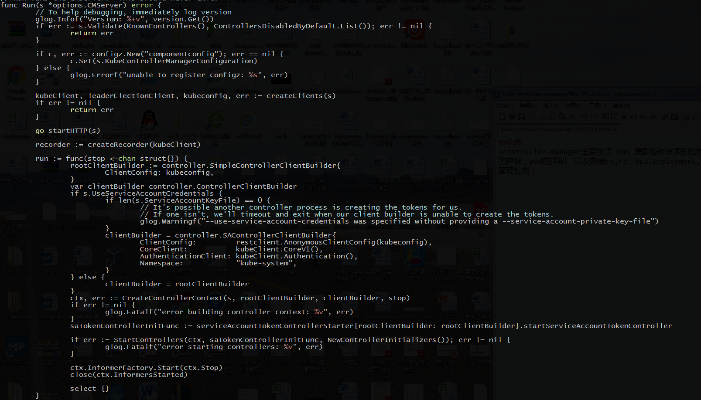
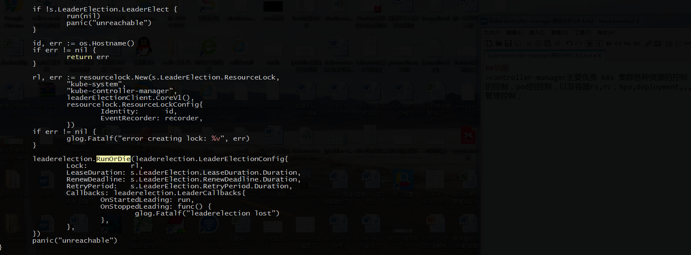
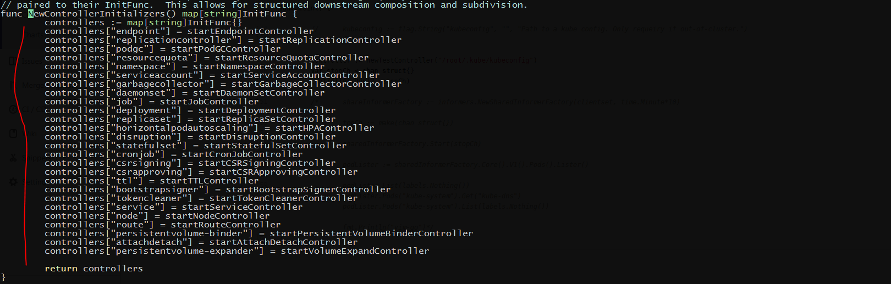

##功能
>controller-manager主要负责 k8s 集群各种资源的控制 功能，如： node的控制，pod的控制，以及容器rs,rc，hpa,deployment,,,等等一系列资源的管理控制；其主要代码是Run()函数，代码如下:
>
>
>其主要框架是 leaderelection 不断的进行 leader 选举，一旦选举到leader,就执行 回调函数
>OnStartedLeading,丢失leader就 执行OnstoppedLeading。 
>接下来其主要的逻辑在 run函数中。其主要的函数有 StartController 和 InformerFactory.Start() 这两个函数，接下来，主要来说这两个函数 
>StartController 将所有事件初始化完毕 之后，包括设置 要监听的事件，设置 回调函数，事件初始化,初始化事件的队列等工作； 
>InformerFactory.Start() 主要负责开始 监听所有的事件变化； 
>informer 监听到相关事件的时候，会将该事件 放入 worker事件队列中，设置好的 Worker函数会从 workerqueue中拿取数据进行处理，各个事件的处理是相互独立的。 
> 
>上图是 kube-controller-manager 的一些主要的controller。 